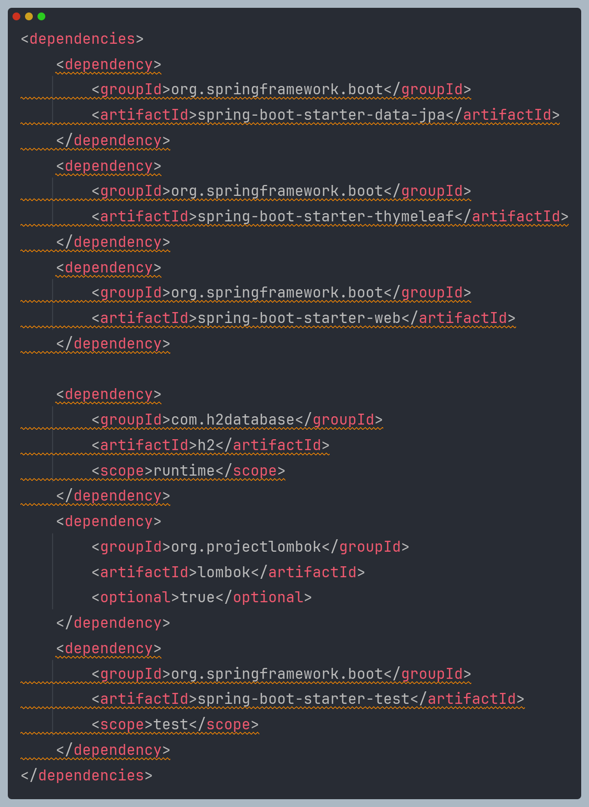
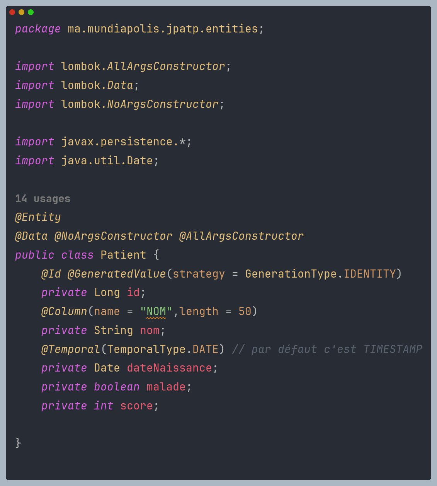
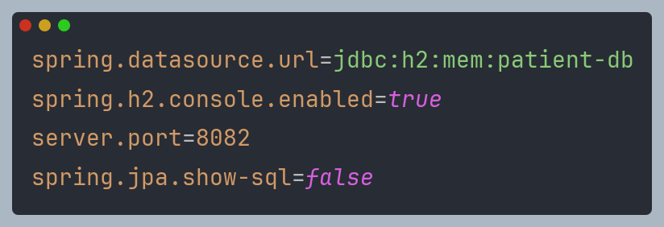
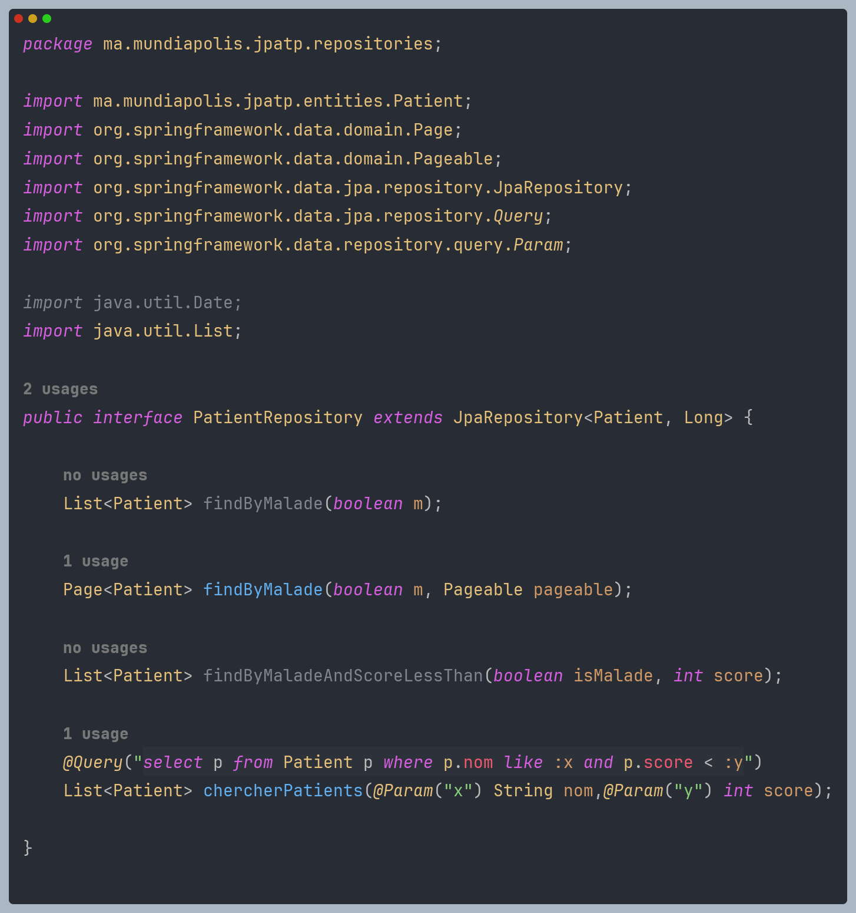
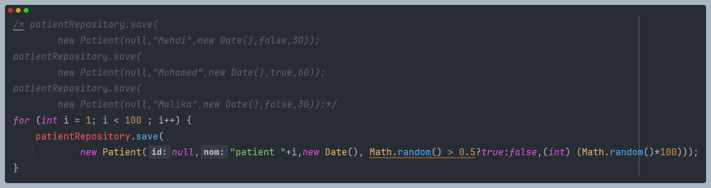
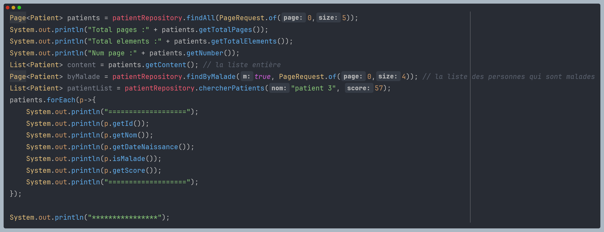
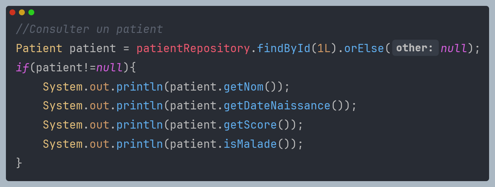
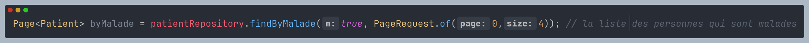
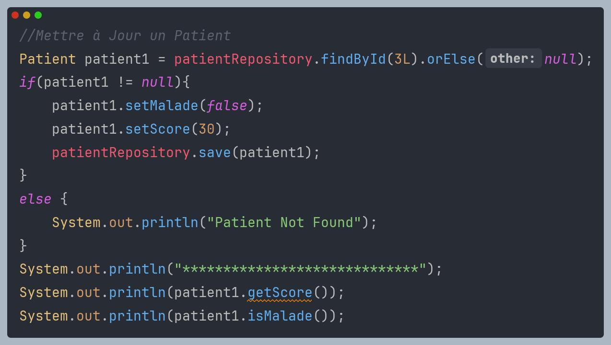
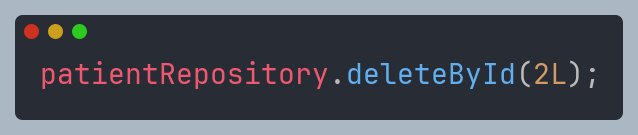

<h1>ORM JDBC JPA Hibernate Spring Data</h1>
<h2>Introduction</h2>

Les Technologies ORM (Object Relational Mapping) sont des outils
permattant de simplifier l'interaction entre les applications Java et les 
bases de données relationnelles comme MySQL.

JDBC (Java Database Connectivity) est une API Java standard pour la gestion des 
bases de données relationnelles. JPA (Java Persistence API) est une spécification
JEE qui définit une interface pour la gestion des entités et des relations entre
les objets Java et les bases de données.

Hibernate est un framework ORM populaire qui implémente la spécification
JPA, facilitant ainsi la persistance des objets Java dans les bases de données.
 Spring Data simplifie encore d'avantage l'accès aux données en fournissant une couche
d'abstraction pour la persistance des données, facilitant l'intégration
de JDBC, JPA, Hibernate et d'autres technologies de gestion de données dans les applications
Spring.

<h2>Énoncé</h2>
<ol>
    <li>Installer IntelliJ Ultimate</li>
    <li>Créer un projet Spring Initializer avec les dépendances JPA,H2,Spring Web et Lombock</li>
    <li>Créer l'entité JPA Patient ayant les attributs :</li>
        <ul>
            <li>id de type Long</li>
            <li>nom de type String</li>
            <li>date de naissance de type Date</li>
            <li>malade de type booléen</li>
            <li>score de type int</li>
        </ul>
    <li>Configurer l'unité de persistance dans le fichier application.properties</li>
    <li>Créer l'interface JPA Repository basée sur Spring Data</li>
    <li>Tester quelques opérations de gestion</li>
        <ul>
            <li>Ajouter des patients</li>
            <li>Consulter tous les patients</li>
            <li>Consulter un patient</li>
            <li>Chercher des patients</li>
            <li>Mettre à jour un patient</li>
            <li>supprimer un patient</li>
        </ul>
    <li>Migrer de h2 Database vers MySQL</li>
</ol>

<h2>Code</h2>

Après installation d'IntelliJ Ultimate, j'ai créé un projet qui porte le
nom <b>jpa-tp</b> avec Spring Initializer en choisissant les dépendances
suivantes :

<ul>
<li>JPA</li>
<li>H2</li>
<li>Spring Web</li>
<li>Lombock</li>
</ul>

Si on consulte le fichier pom.xml, on remarque que les dépendances
ont été ajouté

Ensuite, on crée l'entité JPA Patient avec les attributs demandés

Maintenant, on doit stocker ces données dans une base de données H2.

Il faut préciser à Spring quelle unité de persistence on va utiliser.

fichier application.properties :

La base de donnée qui va être créé portera le nom patient-db.

<b>spring.h2.console.enabled=true</b> nous permet d'accéder à l'interface
de la base de donnée h2, lorsqu'on saisit localhost:8082/h2-console

Voici comment on crée l'interface JPA Repository basée sur Spring
Data de l'entité Patient.

On a ajouté quelques méthodes pour les utiliser ensuite lors du test des
fonctionnalité de gestion des patients. 

Test des opérations : 

<ul>
<li>Ajouter des patients</li>

<li>Consulter tous les patients</li>

<li>Consulter un patient</li>

<li>Chercher des patients</li>

<li>Mettre à jour un patient</li>

<li>supprimer un patient</li>

</ul>